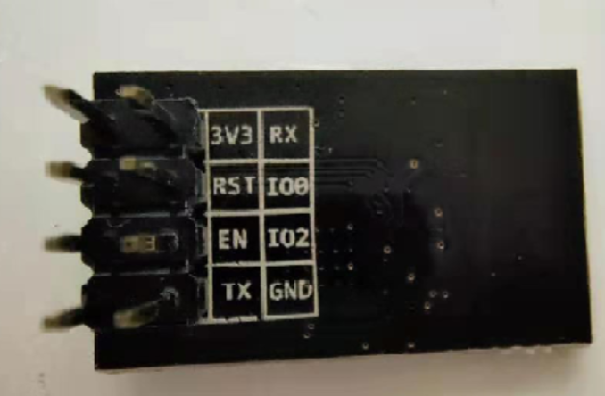

# Intelligent Control Fan and Environmental Monitoring System

(智能温控风扇与环境监测系统)

这是一个基于 Arduino Uno 的智能风扇控制系统，集成了温湿度监测、红外遥控以及通过 WiFi (UDP) 进行远程监控和控制的功能。

## 📋 功能特性

1. **环境监测**：实时读取 DHT11 传感器的温度和湿度数据。
2. **智能温控 (Auto Mode)**：
   * 当温度超过设定阈值（默认 28°C）时，风扇自动启动。
   * 风扇转速随温度升高而自动增加（P控制算法）。
   * 温度低于阈值时风扇停止。
3. **手动控制 (Manual Mode)**：
   * 支持通过红外遥控或 WiFi 远程指令强制设定风速 (0-100%)。
4. **WiFi 远程遥测与控制**：
   * 使用 ESP-01 模块通过 UDP 协议与电脑通信。
   * 电脑端 Python 脚本实时显示环境数据和风扇状态。
   * 支持从电脑端发送指令控制模式和风速。
5. **红外遥控**：支持使用红外遥控器切换模式和微调设置。

## 🛠️ 硬件清单与接线

| 组件                   | Arduino 引脚 | 说明                |
| :--------------------- | :----------- | :------------------ |
| **DHT11 温湿度传感器** | Pin 2        | 数据引脚            |
| **红外接收器 (IR)**    | Pin 3        | 信号引脚            |
| **舵机 (Servo)**       | Pin 6        | 信号引脚 (模拟旋转) |
| **ESP-01 WiFi 模块**   | Pin 10 (TX)  | 接 ESP-01 的 TX     |
|                        | Pin 11 (RX)  | 接 ESP-01 的 RX     |
| **LED 指示灯**         | Pin 13       | 内置 LED (心跳指示) |

> **注意**：ESP-01 模块通常需要独立的 3.3V 供电，直接使用 Arduino 的 3.3V 引脚可能会因电流不足导致不稳定。



### Micro Servo 连线

| 舵机线缆颜色 | Arduino 引脚 | 说明                |
| :----------- | :----------- | :------------------ |
| 红线         | 5V           | 电源正极 (VCC)      |
| 棕线         | GND          | 电源负极 (GND)      |
| 橙线         | Pin 6        | PWM 控制线 (Signal) |

### ESP-01 WiFi 模块连线

| ESP-01 引脚 | Arduino 引脚 | 说明                     |
| :---------- | :----------- | :----------------------- |
| VCC         | 3.3V         | 电源正极 (独立供电推荐)  |
| EN          | 3.3V         | 电源正极 (独立供电推荐)  |
| GND         | GND          | 电源负极                 |
| TX          | Pin 10       | 数据发送 (接 Arduino RX) |
| RX          | Pin 11       | 数据接收 (接 Arduino TX) |

## 💻 软件环境

### Arduino 端

* **IDE**: VS Code + PlatformIO (推荐) 或 Arduino IDE
* **依赖库**:
  * `DHT sensor library` by Adafruit
  * `IRremote` by Armin Joachimsmeyer
  * `Adafruit Unified Sensor`

### 电脑端 (控制台)

* **Python 3.x**
* 无需额外安装第三方库 (使用标准库 `socket`, `threading`, `msvcrt`)

## 🚀 安装与使用

### 1. Arduino 固件烧录

1. 修改 `src/main.cpp` 中的 WiFi 配置：

   ```cpp
   const char *ssid = "你的WiFi名称";
   const char *password = "你的WiFi密码";
   const char *pc_ip = "你的电脑IP地址"; // 运行 Python 脚本的电脑 IP
   ```

2. 连接 Arduino Uno。
3. 使用 PlatformIO 点击 `Upload` 按钮烧录代码。
4. 观察 Arduino 板载 LED (Pin 13) 是否闪烁，表示程序正在运行。

### 2. 启动电脑端控制台

1. 确保电脑与 Arduino 连接在同一个 WiFi 网络下。
2. 打开终端，运行 Python 脚本：

   ```powershell
   python wifi_receiver.py
   ```

3. 等待脚本显示 `[系统] 已锁定 Arduino...`，此时应能看到实时的温湿度数据流。

### 3. 远程控制操作

在 Python 控制台运行期间：

* **查看状态**：默认模式，实时刷新数据。
* **发送指令**：
  1. 按键盘上的 **`r`** 键进入控制模式（数据刷新暂停）。
  2. 输入指令并回车：
     * 输入 **`0` - `100`**：设置风速百分比（自动切换为手动模式）。
     * 输入 **`A`** 或 **`AUTO`**：切换回自动温控模式。
     * 输入 **`M`** 或 **`MANUAL`**：切换为手动模式。
  3. 发送完成后自动返回监控模式。

## 📂 项目结构

```
.
├── include/            # 头文件
├── lib/                # 私有库
├── src/
│   └── main.cpp        # Arduino 主程序 (C++)
├── test/               # 测试文件
├── wifi_receiver.py    # 电脑端远程控制脚本 (Python)
├── platformio.ini      # PlatformIO 项目配置文件
└── README.md           # 项目说明文档
```

## 📝 常见问题

* **Python 端收不到数据？**
  * 检查 `src/main.cpp` 中的 `pc_ip` 是否填写正确。
  * 检查防火墙是否允许 UDP 端口 8080 通信。
  * 确保 ESP-01 的 RX/TX 接线正确（Arduino RX 接 ESP TX）。
* **发送指令无反应？**
  * 确保 Python 脚本显示 `已锁定 Arduino: IP:端口`。
  * Arduino 代码中已启用非阻塞接收，确保没有使用 `delay()` 阻塞主循环。
